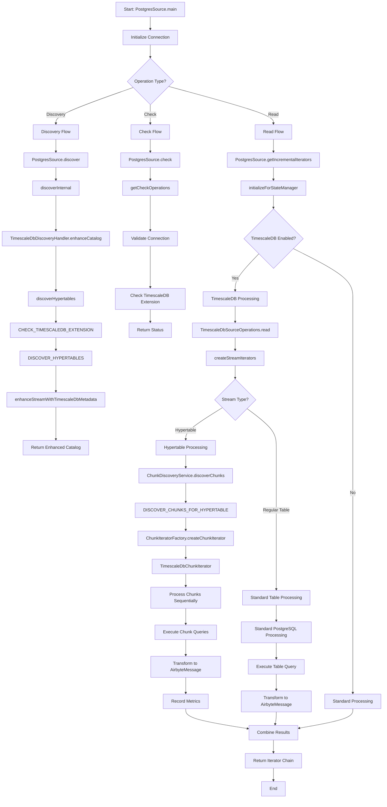

# TimescaleDB Execution Flow in Airbyte Source-Postgres Connector

## Overview

This document explains the execution flow of the Airbyte source-postgres connector when ingesting a TimescaleDB database that contains a mix of hypertables and normal tables. The connector uses specialized processing for TimescaleDB hypertables while maintaining compatibility with regular PostgreSQL tables.

## Macro Flow Chart



## Detailed Execution Flow

### 1. Entry Point and Initialization

**Function**: `PostgresSource.main()`
- **Location**: `PostgresSource.java:724`
- **Purpose**: Main entry point for the connector
- **Flow**: Initializes the connector and delegates to the appropriate operation

**Function**: `PostgresSource.createDatabase()`
- **Location**: `PostgresSource.java:361`
- **Purpose**: Creates JDBC database connection with TimescaleDB-specific configurations
- **Key Operations**:
  - Establishes connection to PostgreSQL database
  - Applies TimescaleDB-specific connection parameters
  - Configures streaming and query optimization settings

### 2. Discovery Phase

#### 2.1 Main Discovery Flow

**Function**: `PostgresSource.discover()`
- **Location**: `PostgresSource.java:314`
- **Purpose**: Discovers available tables and views in the database
- **Key Operations**:
  - Calls `discoverInternal()` to get basic table information
  - Enhances catalog with TimescaleDB metadata if enabled

**Function**: `PostgresSource.discoverInternal()`
- **Location**: `PostgresSource.java:420`
- **Purpose**: Discovers raw table information from PostgreSQL system catalogs
- **Key Operations**:
  - Queries `information_schema` and `pg_catalog` tables
  - Identifies tables, views, and their schemas
  - Returns basic table metadata

#### 2.2 TimescaleDB-Specific Discovery

**Function**: `TimescaleDbDiscoveryHandler.enhanceCatalog()`
- **Location**: `TimescaleDbDiscoveryHandler.java:32`
- **Purpose**: Enhances the discovered catalog with TimescaleDB-specific metadata
- **Key Operations**:
  - Calls `discoverHypertables()` to identify hypertables
  - Enhances each stream with TimescaleDB metadata if it's a hypertable
  - Adds metadata like chunk count, time column, and dimensions

**Function**: `TimescaleDbDiscoveryHandler.discoverHypertables()`
- **Location**: `TimescaleDbDiscoveryHandler.java:95`
- **Purpose**: Discovers all hypertables in the database
- **SQL Query**: `DISCOVER_HYPERTABLES`
- **Key Operations**:
  - Queries `_timescaledb_catalog.hypertable` table
  - Joins with `_timescaledb_catalog.dimension` for time column information
  - Returns comprehensive hypertable metadata

#### 2.3 TimescaleDB Extension Check

**Function**: `TimescaleDbQueries.CHECK_TIMESCALEDB_EXTENSION`
- **Location**: `TimescaleDbQueries.java:18`
- **Purpose**: Verifies if TimescaleDB extension is installed
- **SQL Query**:
  ```sql
  SELECT EXISTS(
      SELECT 1 FROM pg_extension 
      WHERE extname = 'timescaledb'
  ) as timescaledb_available
  ```

### 3. Check Phase

**Function**: `PostgresSource.check()`
- **Location**: `PostgresSource.java:732`
- **Purpose**: Validates connection and configuration
- **Key Operations**:
  - Tests database connectivity
  - Validates TimescaleDB extension if TimescaleDB support is enabled
  - Checks user permissions for required operations

### 4. Read Phase

#### 4.1 Main Read Flow

**Function**: `PostgresSource.getIncrementalIterators()`
- **Location**: `PostgresSource.java:528`
- **Purpose**: Creates iterators for reading data from configured streams
- **Key Operations**:
  - Initializes state manager and categorizes streams
  - Determines processing method based on sync mode (CDC, cursor-based, etc.)
  - Delegates to appropriate processing handler

**Function**: `PostgresSource.initializeForStateManager()`
- **Location**: `PostgresSource.java:852`
- **Purpose**: Initializes state management components
- **Key Operations**:
  - Categorizes streams for different processing methods
  - Initializes CTID state manager for resumable full refresh
  - Sets up file node handlers for tracking table changes

#### 4.2 TimescaleDB Source Operations

**Function**: `TimescaleDbSourceOperations.read()`
- **Location**: `TimescaleDbSourceOperations.java:66`
- **Purpose**: Main orchestrator for TimescaleDB data reading
- **Key Operations**:
  - Logs start of TimescaleDB read operation
  - Creates stream iterators with TimescaleDB-specific processing
  - Handles both hypertables and regular tables

**Function**: `TimescaleDbSourceOperations.createStreamIterators()`
- **Location**: `TimescaleDbSourceOperations.java:83`
- **Purpose**: Creates appropriate iterators for each stream type
- **Key Operations**:
  - Checks if stream is a hypertable using `ChunkDiscoveryService`
  - Routes hypertables to chunk-based processing
  - Routes regular tables to standard processing

#### 4.3 Hypertable Processing

**Function**: `ChunkDiscoveryService.discoverChunks()`
- **Location**: `ChunkDiscoveryService.java:47`
- **Purpose**: Discovers chunks for a specific hypertable
- **Key Operations**:
  - Checks cache for existing chunk metadata
  - Queries database for chunk information if cache miss
  - Updates cache and records metrics

**Function**: `ChunkDiscoveryService.isHypertable()`
- **Location**: `ChunkDiscoveryService.java:89`
- **Purpose**: Determines if a table is a TimescaleDB hypertable
- **SQL Query**: `CHECK_IS_HYPERTABLE`
- **Key Operations**:
  ```sql
  SELECT EXISTS(
      SELECT 1 FROM _timescaledb_catalog.hypertable 
      WHERE schema_name = ? AND table_name = ?
  ) as is_hypertable
  ```

#### 4.4 Chunk Processing

**Function**: `ChunkIteratorFactory.createChunkIterator()`
- **Location**: `ChunkIteratorFactory.java:58`
- **Purpose**: Creates iterator for processing chunks sequentially
- **Key Operations**:
  - Creates `TimescaleDbChunkIterator` instance
  - Passes chunk metadata and stream configuration
  - Sets up chunk-based processing pipeline

**Function**: `TimescaleDbChunkIterator.computeNext()`
- **Location**: `ChunkIteratorFactory.java:120`
- **Purpose**: Processes individual chunks one by one
- **Key Operations**:
  - Builds chunk-specific SQL queries
  - Executes queries against individual chunks
  - Transforms results to `AirbyteMessage` format
  - Records processing metrics

#### 4.5 Chunk Queries

**Function**: `TimescaleDbQueries.DISCOVER_CHUNKS_FOR_HYPERTABLE`
- **Location**: `TimescaleDbQueries.java:55`
- **Purpose**: Discovers all chunks for a specific hypertable
- **SQL Query**:
  ```sql
  SELECT 
      c.chunk_schema,
      c.chunk_name,
      c.hypertable_schema,
      c.hypertable_name,
      c.range_start,
      c.range_end,
      COALESCE(pg_total_relation_size(format('%I.%I', c.chunk_schema, c.chunk_name)), 0) as size_bytes,
      c.chunk_id
  FROM timescaledb_information.chunks c
  WHERE c.hypertable_schema = ? AND c.hypertable_name = ?
  ORDER BY c.range_start
  ```

**Function**: `TimescaleDbQueries.CHUNK_SELECT_TEMPLATE`
- **Location**: `TimescaleDbQueries.java:231`
- **Purpose**: Template for building chunk-specific SELECT queries
- **Template Structure**:
  ```sql
  SELECT %s FROM %s.%s ORDER BY %s
  ```

### 5. CDC Integration

#### 5.1 CDC Schema Configuration

**Function**: `PostgresCdcProperties.getTimescaleDbSchemaIncludeList()`
- **Location**: `PostgresCdcProperties.java:205`
- **Purpose**: Builds schema include list for TimescaleDB CDC
- **Key Operations**:
  - Discovers all schemas containing hypertables
  - Includes `_timescaledb_internal` schema for chunk processing
  - Returns comma-separated list of schemas

#### 5.2 CDC Stream Processing

**Function**: `PostgresCdcCtidInitializer.cdcCtidIteratorsCombined()`
- **Purpose**: Combines CDC and CTID iterators for comprehensive data capture
- **Key Operations**:
  - Handles initial load for hypertables using chunk-based approach
  - Processes CDC events for ongoing changes
  - Manages state transitions between initial load and CDC

### 6. State Management

#### 6.1 Chunk State Tracking

**Function**: `ChunkMetadata`
- **Location**: `ChunkMetadata.java:1`
- **Purpose**: Represents metadata for a TimescaleDB chunk
- **Key Properties**:
  - `chunkSchema`: Schema containing the chunk
  - `chunkName`: Name of the chunk
  - `rangeStart`/`rangeEnd`: Time range boundaries
  - `sizeBytes`: Chunk size for memory management

#### 6.2 Progress Tracking

**Function**: `TimescaleDbMetrics.recordChunkProcessed()`
- **Location**: `TimescaleDbMetrics.java:37`
- **Purpose**: Records metrics for processed chunks
- **Key Operations**:
  - Tracks processing time per chunk
  - Records record count and data volume
  - Maintains throughput statistics
  - Logs progress summaries

### 7. Error Handling and Fallbacks

#### 7.1 Fallback Processing

**Function**: `TimescaleDbSourceOperations.createStandardIterator()`
- **Location**: `TimescaleDbSourceOperations.java:146`
- **Purpose**: Falls back to standard PostgreSQL processing when TimescaleDB processing fails
- **Key Operations**:
  - Logs fallback warning
  - Creates standard JDBC iterator
  - Maintains compatibility with regular PostgreSQL tables

#### 7.2 Cache Management

**Function**: `ChunkDiscoveryService.invalidateCache()`
- **Location**: `ChunkDiscoveryService.java:135`
- **Purpose**: Manages chunk metadata cache
- **Key Operations**:
  - Invalidates cache entries when needed
  - Handles cache TTL expiration
  - Provides cache statistics for monitoring

### 8. Memory Management

#### 8.1 Memory Estimation

**Function**: `ChunkMetadata.estimateMemoryUsage()`
- **Location**: `ChunkMetadata.java:82`
- **Purpose**: Estimates memory usage for chunk processing
- **Algorithm**: `max(chunkSize / 10, 1MB)`
- **Purpose**: Conservative memory estimation for resource management

#### 8.2 Concurrent Processing

**Function**: `TimescaleDbConfiguration.getMaxConcurrentChunks()`
- **Purpose**: Controls maximum number of chunks processed concurrently
- **Key Operations**:
  - Limits memory usage through concurrency control
  - Prevents overwhelming the database with parallel queries
  - Balances performance with resource constraints

## Key SQL Queries

### TimescaleDB System Queries

1. **Extension Check**:
   ```sql
   SELECT EXISTS(SELECT 1 FROM pg_extension WHERE extname = 'timescaledb') as timescaledb_available
   ```

2. **Hypertable Discovery**:
   ```sql
   SELECT h.schema_name, h.table_name, h.num_dimensions, d.column_name as time_column_name
   FROM _timescaledb_catalog.hypertable h
   LEFT JOIN _timescaledb_catalog.dimension d ON h.id = d.hypertable_id
   WHERE d.dimension_type = 1
   ```

3. **Chunk Discovery**:
   ```sql
   SELECT c.chunk_schema, c.chunk_name, c.range_start, c.range_end, 
          pg_total_relation_size(format('%I.%I', c.chunk_schema, c.chunk_name)) as size_bytes
   FROM timescaledb_information.chunks c
   WHERE c.hypertable_schema = ? AND c.hypertable_name = ?
   ORDER BY c.range_start
   ```

### Data Queries

1. **Chunk Data Selection**:
   ```sql
   SELECT column1, column2, ... FROM chunk_schema.chunk_name ORDER BY time_column
   ```

2. **Standard Table Selection**:
   ```sql
   SELECT column1, column2, ... FROM schema.table_name ORDER BY cursor_column
   ```

## Performance Considerations

### 1. Chunk Processing Benefits
- **Parallel Processing**: Multiple chunks can be processed concurrently
- **Memory Efficiency**: Only one chunk's data is loaded at a time
- **Resumability**: Failed processing can resume from the last successful chunk
- **Ordering**: Chunks are processed in chronological order

### 2. Configuration Tuning
- **`timescaledb_max_concurrent_chunks`**: Controls parallelism
- **`timescaledb_chunk_cache_ttl_minutes`**: Cache freshness vs. performance
- **`timescaledb_max_memory_mb`**: Memory usage limits

### 3. Database Optimization
- **Chunk Size**: Optimal chunk intervals improve processing efficiency
- **Indexing**: Proper indexes on time columns accelerate chunk queries
- **Compression**: Compressed chunks reduce I/O overhead

## Error Scenarios and Handling

### 1. TimescaleDB Extension Missing
- **Detection**: Extension check fails during discovery
- **Fallback**: Process as regular PostgreSQL database
- **Logging**: Warns about missing TimescaleDB support

### 2. Chunk Discovery Failure
- **Detection**: Chunk queries fail or return no results
- **Fallback**: Fall back to standard table processing
- **Logging**: Logs error and fallback action

### 3. Individual Chunk Processing Failure
- **Detection**: Chunk query execution fails
- **Fallback**: Skip problematic chunk and continue
- **Logging**: Records chunk-specific error for debugging

### 4. Memory Pressure
- **Detection**: Memory usage exceeds configured limits
- **Mitigation**: Reduce concurrent chunk processing
- **Logging**: Warns about memory constraints

## Monitoring and Observability

### 1. Metrics Collection
- **Chunk Processing Time**: Individual and average processing times
- **Throughput**: Records per second and bytes per second
- **Success Rate**: Successful vs. failed chunk processing
- **Memory Usage**: Peak and average memory consumption

### 2. Logging Levels
- **INFO**: Major processing milestones and performance summaries
- **DEBUG**: Detailed chunk processing information
- **WARN**: Fallback scenarios and performance issues
- **ERROR**: Critical failures requiring attention

### 3. Progress Tracking
- **Chunk Progress**: Number of chunks processed vs. total
- **Time Estimates**: Estimated completion time based on current rate
- **State Persistence**: Resumable processing state information

## Conclusion

The TimescaleDB integration in the Airbyte source-postgres connector provides sophisticated handling of time-series data while maintaining full compatibility with regular PostgreSQL tables. The chunk-based processing approach enables efficient, scalable, and resumable data ingestion from TimescaleDB hypertables, with comprehensive error handling and performance optimization features.

The architecture allows for:
- **Seamless Integration**: Mixed environments with both hypertables and regular tables
- **Performance Optimization**: Chunk-based processing with configurable parallelism
- **Reliability**: Comprehensive error handling and fallback mechanisms
- **Observability**: Detailed metrics and logging for monitoring and debugging
- **Scalability**: Memory-efficient processing of large time-series datasets 